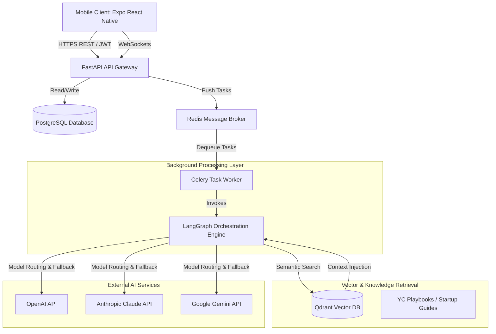
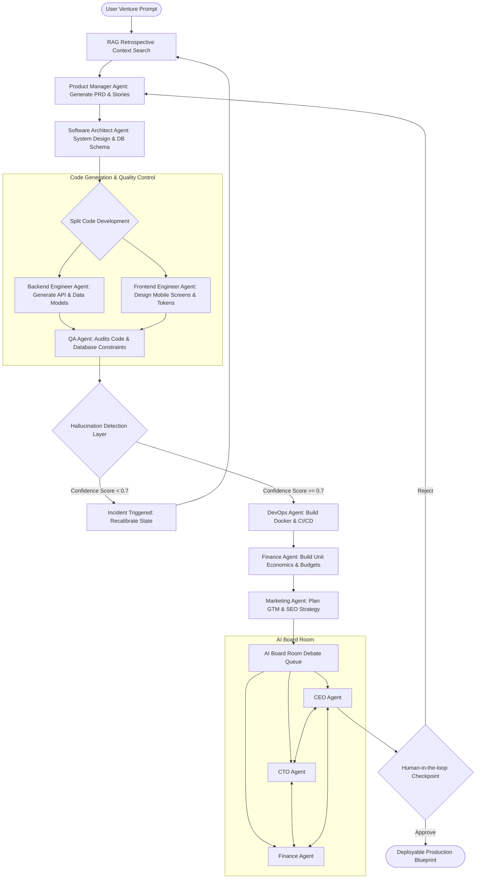

# ForgeAI System Architecture Specifications

---

## 1. High-Level System Architecture (C4 Container Model)

ForgeAI is structured as a collection of decoupled, high-performance services interacting via RESTful APIs, WebSockets, and asynchronous task queues:



---

## 2. Mobile Architecture (React Native / Expo)

The mobile client is built using React Native and Expo with TypeScript. It enforces a strict **feature-first directory layout** to optimize scaling.

### Architectural Blueprint:
```
                                +---------------------------+
                                |      React Components     |
                                |  (Screens / Shared UI)    |
                                +-------------+-------------+
                                              |
                                              v
                                +-------------+-------------+
                                |       React Query         |
                                |   (API Server State)      |
                                +-------------+-------------+
                                              |
                                              v
  +-------------------------+   +-------------+-------------+
  |  Zustand Storage State  |---|     Zustand Store Engine  |
  |  (Offline Cache Sync)   |   |   (Local & Session State) |
  +-------------------------+   +---------------------------+
```

### Key Subsystems:
* **State Management**: React Query handles all asynchronous, remote server-state interactions (caching, query invalidation, refetching on reconnect). Zustand handles UI state, active navigation tabs, authentication tokens, and offline caching structures.
* **Offline Capability**: Zustand stores are wrapped with `persist` middleware pointing to `@react-native-async-storage/async-storage`. If requests fail due to network drops, actions are queued, and a offline-status Banner is displayed.
* **WebView Integration**: Custom React Native WebViews with shared authentication tokens embed generated PRDs, API schemas, and interactive dashboards, allowing founders to browse complex generated documentation without bloating the native UI.

---

## 3. Backend Architecture (FastAPI & Celery)

FastAPI acts as the high-speed gateway, handling requests with extremely low latency, while Celery manages long-running multi-agent debates and venture creation tasks.

```
+--------------------------------------------------------------+
|                       FastAPI Gateway                        |
|   +------------------+  +------------------+  +----------+   |
|   | Auth/RBAC Middl. |  | Rate Limiting M. |  | OTel MW. |   |
|   +------------------+  +------------------+  +----------+   |
+------------------------------+-------------------------------+
                               |
                               | Task Dispatch
                               v
                       +---------------+
                       |  Redis Queue  |
                       +-------+-------+
                               |
                               v Task Consumption
+--------------------------------------------------------------+
|                     Celery Worker Pool                       |
|   +------------------------------------------------------+   |
|   | LangGraph Engine (Workforce & Board Room Workflows)  |   |
|   |   - RAG Agent Controller                             |   |
|   |   - Verification & Fact Checking Pipeline            |   |
|   |   - Model-Routing & Budget Controller                |   |
|   +------------------------------------------------------+   |
+------------------------------+-------------------------------+
                               | Database State Synchronization
                               v
                    +--------------------+
                    |   PostgreSQL DB    |
                    +--------------------+
```

---

## 4. Multi-Agent Architecture (LangGraph State Machine)

The Agent Orchestration Engine uses LangGraph to coordinate different specialist agents. The graph utilizes a central state object representing the startup's status, generated files, and pending task lists.

### LangGraph Agent State Flow:


### Agent Communication & Shared Memory:
* **State Updates**: Agents communicate by modifying a shared state instance (`VentureState`). Each state transition is logged in the database to allow step-by-step UI replay.
* **Shared Memory**: Short-term execution memory is held within the LangGraph state context. Long-term memory is persisted in PostgreSQL as a vector embedding in Qdrant (using structural keywords of past decisions) so that subsequent developer/architect tasks are informed by decisions made in the Board Room.
